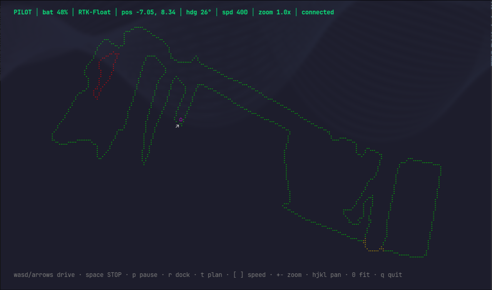

# Mammo — Go CLI for Mammotion Lawnmowers

Mammo is a Go module and command-line app for controlling and monitoring
Mammotion robot mowers (Luba, Luba 2 & Yuka) over the MQTT cloud (Aliyun IoT).

It started as a port of the [PyMammotion](https://github.com/mikey0000/PyMammotion)
Python project and has grown a high-resolution terminal map and live driving UI.
Still a work in progress.

## Features

- **`pilot` — live map + driving in one full-screen TUI.** Renders the mower's
  map (mowing areas, no-go zones, channels, dock) in **braille sub-character
  resolution** — 8× the detail of plain ASCII — in colour, with the mower's
  position, heading and travel trail drawn live on top. Drive it with the
  keyboard, watch the planned coverage route, pause, or send it home.
- **High-fidelity map rendering** with uniform metric scaling, zoom and pan, and
  an off-screen pointer so the mower is never lost off the edge of the view.
- **Map download** to a portable JSON file, and offline rendering of saved maps.
- **One-shot control commands** for return-to-dock, cancel, leave-pile and
  fixed-duration moves, usable from scripts.
- **RTK fix quality**, battery and charging state shown live.

## Install / Build

    go build -o mammo

All commands authenticate with your Mammotion account via global flags:

    -u, --username   Mammotion account email
    -p, --password   Mammotion account password

The first device on the account is used.

## Pilot mode

    ./mammo pilot -u you@example.com -p yourpassword

A full-screen map of your lawn with the mower live on it. The header shows mode,
battery (⚡ when charging), RTK fix quality, position, heading, speed and zoom.

### Controls

| Key | Action |
| --- | --- |
| `w` `a` `s` `d` / arrows | drive forward / left / back / right |
| `space` | emergency stop |
| `p` | pause / resume the current task |
| `r` | return to charger |
| `t` | toggle the planned coverage path (cyan) |
| `[` `]` | decrease / increase drive speed |
| `+` `-` | zoom out / in |
| `h` `j` `k` `l` | pan the view |
| `0` | reset zoom and pan to fit |
| `q` | quit (always sends a stop first) |

The map layers: **green** = mowing-area boundaries, **red** = obstacles / no-go
zones, **gold** = channels between zones, **cyan** = the planned coverage
(zigzag) route for the active task, **blue** = the mower's actual trail,
**⌂** = dock, and an arrow for the mower showing its heading.

### Pilot flags

    --map <file.json>       render a saved map instead of fetching from the mower
    --save-map <file.json>  save the fetched map while running
    --view-only             observe only; disable all driving/control commands
    --min-battery <pct>     disable driving below this battery level (default 15)

Driving is blocked below `--min-battery` so a low battery can't be run flat away
from the dock. **Pause and return-to-charger stay available at any battery
level.**

## Maps

Download the mower's map to a JSON file (areas, obstacles, channels, dock):

    ./mammo map-download -u you@example.com -p yourpassword -o mylawn.json

Render a saved map offline, at full resolution, sized to your terminal:

    ./mammo map-show mylawn.json

Uploading a map back to the mower is **not supported** — the known Mammotion
protocol has no app→device write for map geometry (maps are created on-device by
boundary recording). `map-upload` validates a file and explains this rather than
sending anything that could corrupt the stored map.

## Other commands

| Command | Description |
| --- | --- |
| `login` | Test the cloud connection and authentication |
| `battery` | Print the battery level |
| `position --duration <s>` | Print live position updates for N seconds |
| `move --linear --angular --duration` | Drive for a fixed time, then auto-stop |
| `recharge` | Send the mower back to the dock |
| `cancel` | Cancel the current sub-task |
| `leave-pile` | One-touch leave-pile (if stuck near the dock) |

`sustask` and `task-ctrl` are experimental raw-protocol probes.

## Notes on coordinates

Map geometry and live position share one coordinate frame. Live position
(`RealPos`) is reported in 0.1 mm units (divide by 10000 for metres); heading
(`real_toward`) is in 0.0001° units and is already a compass bearing (0 = north,
clockwise). Under DGPS (no RTK fix) heading is noisy; it settles with RTK
Fixed/Float.

## References

Aliyun [Living Link APIs](https://g.alicdn.com/aic/ilop-docs/1.0.22/index.html).
